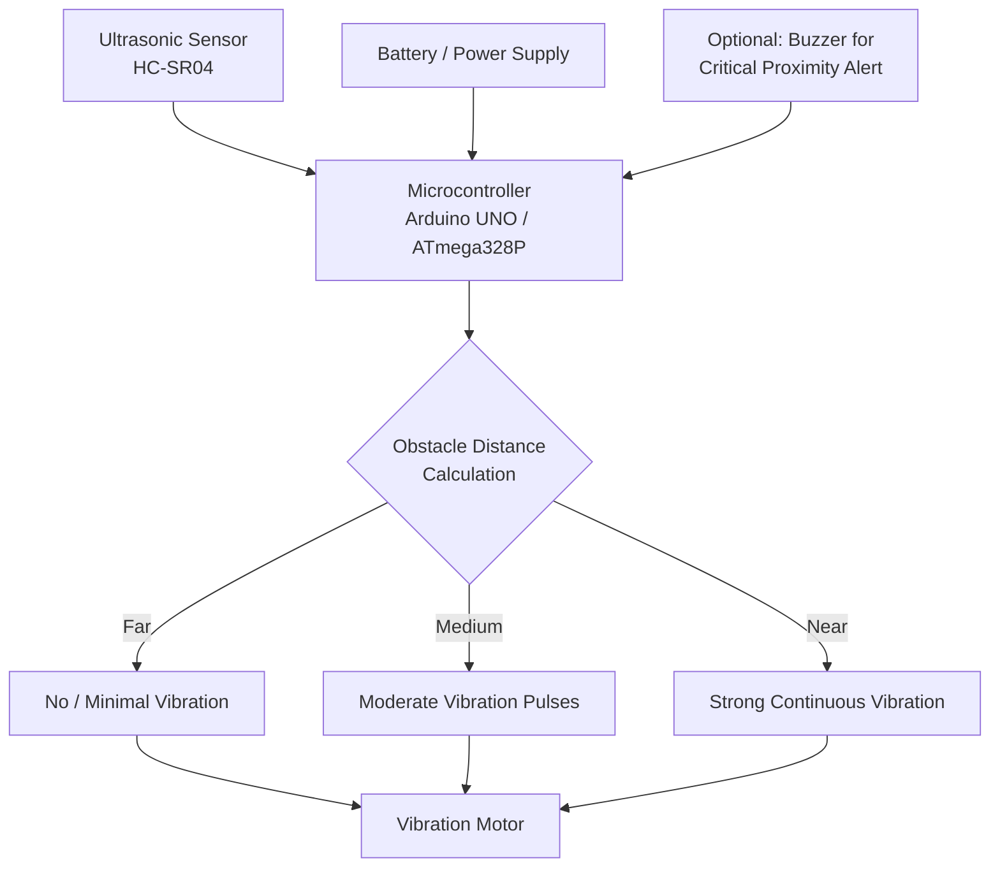

# 🦯 Bio-Inspired Navigation Device – Assistive Aid for the Visually Impaired

An embedded assistive navigation device developed for the **Smart India Hackathon (SIH)**, designed to help visually impaired individuals detect nearby obstacles and navigate safely using real-time **vibration feedback**, inspired by echolocation used by bats and other animals.

---

## 📌 Table of Contents
- [Overview](#-overview)
- [Problem Statement](#-problem-statement)
- [Features](#-features)
- [System Architecture / Block Diagram](#-system-architecture--block-diagram)
- [Components Used](#-components-used)
- [Working Principle](#-working-principle)
- [Circuit Connections](#-circuit-connections)
- [Software / Code](#-software--code)
- [Advantages](#-advantages)
- [Applications](#-applications)
- [Limitations](#-limitations)
- [Future Scope](#-future-scope)
- [Tech Stack](#-tech-stack)
- [How to Run](#-how-to-run)
- [Screenshots / Demo](#-screenshots--demo)
- [Author](#-author)

---

## 📖 Overview

Visually impaired individuals typically rely on a white cane or guide dog to detect obstacles, but these methods have limited range and cannot detect obstacles above waist height (e.g., low-hanging branches, open cabinet doors, or protruding signboards). This project is **inspired by bio-sonar (echolocation)** — the way bats and dolphins sense their surroundings using sound waves — to build a compact, wearable device that detects obstacles in the user's path and provides **real-time vibration feedback**, alerting them before a collision occurs.

The device uses **ultrasonic sensors** to continuously scan the surroundings and a **vibration motor** to translate distance data into intuitive tactile feedback — the closer the obstacle, the stronger/faster the vibration.

---

## ❗ Problem Statement

- Traditional white canes only detect ground-level and close-range obstacles.
- Visually impaired individuals face difficulty detecting elevated or overhanging obstacles.
- Existing electronic aids are often expensive or bulky.
- There is a need for a low-cost, lightweight, wearable device that provides intuitive, non-visual, non-auditory feedback (important since hearing is often relied upon for ambient awareness).

---

## ✨ Features

- 📡 **Real-time obstacle detection** using ultrasonic sensing
- 📳 **Tactile (vibration) feedback** — doesn't block hearing, unlike buzzer-based systems
- 🎚️ **Variable feedback intensity** — vibration strength/frequency increases as obstacles get closer
- 🔋 **Compact, wearable, battery-powered** design (hand-held, cane-mounted, or belt/wrist-mounted)
- 🧠 Simple microcontroller-based logic, easily extendable
- 💰 Low-cost alternative to commercial electronic travel aids (ETAs)

---

## 🧩 System Architecture / Block Diagram



**Flow explanation:**
1. The **ultrasonic sensor**, mounted on the device (cane, wristband, or handheld unit), continuously emits sound pulses and measures the time for the echo to return.
2. The **microcontroller** converts this into a distance value in real time.
3. Based on distance thresholds, the microcontroller drives a **vibration motor** with varying intensity/pattern:
   - Obstacle far away → no or gentle vibration
   - Obstacle at medium range → moderate pulsing vibration
   - Obstacle very close → strong, continuous vibration (urgent warning)
4. An optional **buzzer** can trigger for critical, very-close-range obstacles as a redundant safety alert.

---

## 🔧 Components Used

| Component | Purpose |
|---|---|
| Arduino UNO / ATmega328P | Main microcontroller / processing unit |
| Ultrasonic Sensor (HC-SR04) | Obstacle distance detection |
| Vibration Motor (Coin/DC type) | Tactile feedback to the user |
| Transistor (e.g., 2N2222) + Diode | Driving the vibration motor safely from a digital pin |
| Buzzer (optional) | Secondary alert for very close obstacles |
| Li-ion Battery / 9V Battery + Regulator | Portable power source |
| Enclosure / Wearable mount | Housing for cane, wrist, or belt attachment |

---

## ⚙️ Working Principle

1. **Power ON** → microcontroller initializes the ultrasonic sensor and sets the vibration motor to OFF.
2. **Continuous Scanning:** The ultrasonic sensor sends out ultrasonic pulses at fixed intervals and measures the echo return time to calculate distance to the nearest obstacle.
3. **Distance Classification:** The measured distance is compared against pre-set thresholds:
   - `> 150 cm` → No obstacle warning
   - `50–150 cm` → Moderate vibration (pulsed)
   - `< 50 cm` → Strong, continuous vibration (immediate danger)
4. **Feedback Delivery:** The microcontroller drives the vibration motor (via a transistor switch, since motors draw more current than a GPIO pin can supply) at the corresponding intensity/pattern.
5. **Continuous Loop:** This scan-classify-feedback cycle repeats several times per second, giving the user near real-time awareness of their surroundings as they move.

---

## 🔌 Circuit Connections

| Ultrasonic Sensor (HC-SR04) | Arduino Pin |
|---|---|
| VCC | 5V |
| GND | GND |
| TRIG | D2 |
| ECHO | D3 |

| Vibration Motor Circuit | Arduino Pin |
|---|---|
| Transistor Base (via resistor) | D9 (PWM) |
| Motor +ve | Battery +ve (via transistor collector) |
| Motor -ve | GND |
| Flyback Diode | Across motor terminals (protects circuit) |

| Buzzer (optional) | Arduino Pin |
|---|---|
| +ve | D7 |
| -ve | GND |

*(Pin numbers are configurable — update according to your actual wiring.)*

---

## 💻 Software / Code

Full working Arduino sketch: [`bio_navigation_device.ino`](./bio_navigation_device.ino)

**High-level flow:**
```
Initialize ultrasonic sensor, vibration motor (PWM), buzzer
loop:
    distance = readUltrasonic(sensor)

    if distance > FAR_THRESHOLD:
        vibrationMotor.off()
    elif distance > NEAR_THRESHOLD:
        vibrationMotor.pulse(mediumIntensity)
    else:
        vibrationMotor.on(fullIntensity)
        buzzer.alert()   // optional, for critical proximity
```

---

## ✅ Advantages

- **Non-intrusive feedback** — vibration doesn't interfere with the user's hearing, unlike audio-based systems.
- **Detects elevated/overhanging obstacles** that a traditional white cane misses.
- **Intuitive & fast reaction** — proportional vibration intensity gives a natural sense of proximity.
- **Low-cost & lightweight**, making it accessible compared to commercial electronic travel aids.
- **Portable and wearable** — can be cane-mounted, wrist-worn, or handheld.
- **Battery-efficient** design suitable for all-day use.

---

## 🏙️ Applications

- Personal mobility aid for visually impaired individuals (indoor & outdoor)
- Can be integrated into smart canes
- Assistive technology for elderly individuals with reduced vision
- Educational institutions for the visually impaired
- Rehabilitation centers and mobility training programs

---

## ⚠️ Limitations

- Ultrasonic sensors have a limited detection cone and may miss very thin obstacles (e.g., a pole at certain angles).
- Performance can be affected by sensor range limits (typically up to ~4m) and reflective/absorptive surfaces.
- Currently detects distance in one direction only; doesn't map full surroundings.
- Requires periodic battery charging/replacement.

---

## 🚀 Future Scope

- Add **multiple ultrasonic sensors** for 180°/360° obstacle coverage.
- Integrate **GPS + voice navigation** for outdoor route guidance.
- Add **machine learning-based object classification** (e.g., distinguishing a person from a wall) using a camera module.
- Include **fall detection** and **emergency SOS alert** via GSM module.
- Develop a **companion mobile app** for caretakers to track the user's location.
- Miniaturize the design into a smart cane grip or wearable band for greater convenience.

---

## 🛠️ Tech Stack

- **Hardware:** Arduino UNO / ATmega328P, HC-SR04 Ultrasonic Sensor, Vibration Motor, Buzzer
- **Firmware:** Embedded C / Arduino IDE
- **Tools:** Arduino IDE, Git & GitHub, Multisim (for circuit simulation)

---

## ▶️ How to Run

1. Clone this repository:
   ```bash
   git clone https://github.com/<https://github.com/manasareddy0129>/bio-inspired-navigation-device.git
   ```
2. Open the `.ino` file in **Arduino IDE**.
3. Install the required libraries if any (this project uses only built-in Arduino functions).
4. Select the correct board (Arduino UNO) and COM port.
5. Upload the code to your microcontroller.
6. Wire the circuit as per the connection table above and test by moving an object toward the sensor.

---


---

## 👩‍💻 Author

**Manasa Reddy Seelam**
B.Tech, Electronics and Communication Engineering
📧 seelammanasareddy3@gmail.com

---

⭐ If you found this project useful, consider giving this repository a star!
